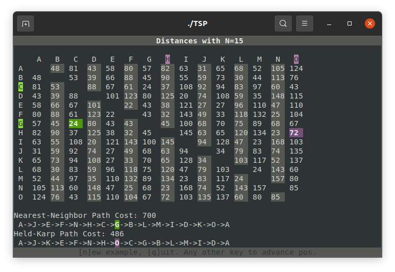

# The Traveling Salesman Problem

"Given a list of cities and the distances between each pair of cities,
what is the shortest possible route that visits each city exactly once
and returns to the origin city?"

Solutions:
- Brute force O(n!) - Exact solution, can get out of hand when n > 11
- Nearest Neighbor Heuristic O(n^2) - Approximate, doesn't guarantee
shortest path (Averages about 25% less efficient than an exact solution)
- Held-Karp Algorithm O(n^2 * 2n) - Exact solution

For this program, I've assumed that all Nodes are connected to every other
Node (the graph is fully connected).

The important part (the Held-Karp implementation) is in src/heldkarp.c.
Shockingly "simple" for the amount of heavy lifting it has to do!

Fun fact: For N locations, there are N!/(2^N) solutions to this problem
(assuming the distance between two individual locations is the same forward as
backward - B to C is the same as C to B, etc). At 20 locations this is
2,375,880,867,360,000 - or two quadrillion, three hundred seventy-five trillion,
eight hundred eighty billion, eight hundred sixty-seven million, three hundred
sixty thousand possible combinations. 

This project uses bits and pieces from my toolbox project and Cards project -
mostly for the super snazzy colored terminal output.

